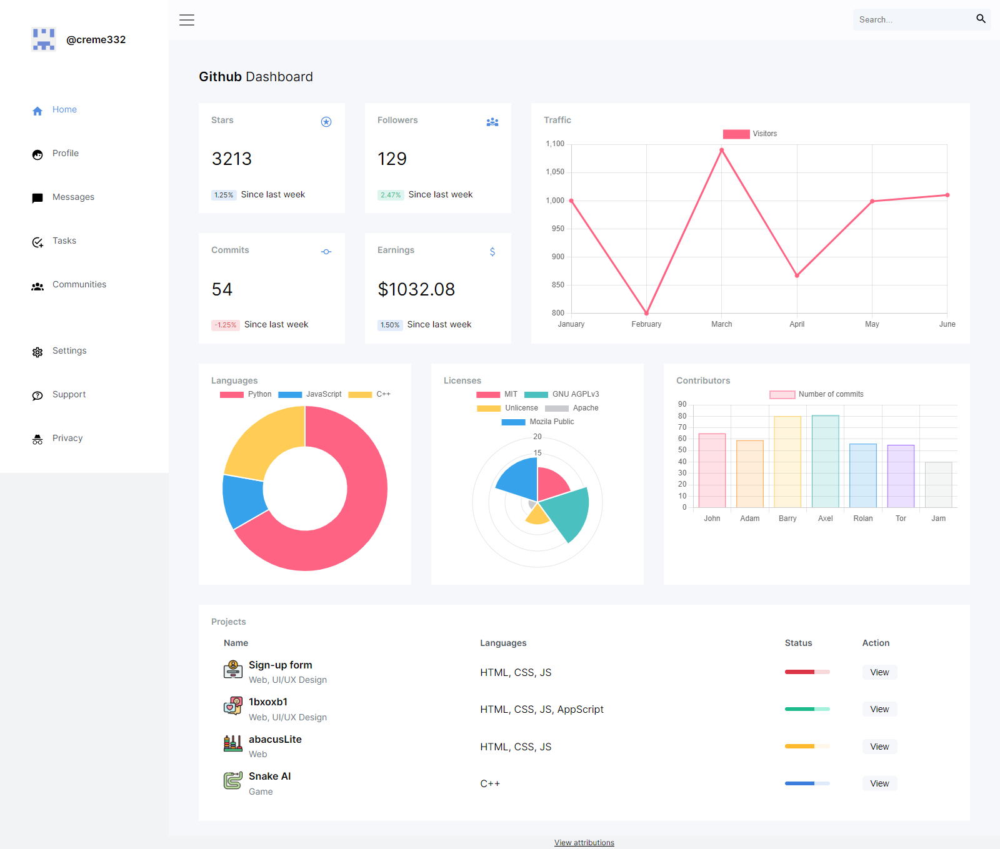

# Github Admin Dashboard

A prototype admin dashboard for managing your Github account.

[▶ Live Preview](https://creme332.github.io/my-odin-projects/admin-dashboard/)

# 🚀Features
- Interactive charts.
- Can expand/collapse sidebar. (buggy)
- Responsive design. (buggy)

# 📌 Attributions

- [UI by adminkit](https://demo.adminkit.io/index.html)
- Interactive charts made with [chart.js](https://www.chartjs.org/)
- Black icons by  [materialdesignicons](https://materialdesignicons.com/)
- <a href="https://www.flaticon.com/free-icons/log-in" title="log in icons">Log in icons created by Freepik - Flaticon</a>
- <a href="https://www.flaticon.com/free-icons/chat-box" title="chat box icons">Chat box icons created by Freepik - Flaticon</a>
- <a href="https://www.flaticon.com/free-icons/abacus" title="abacus icons">Abacus icons created by Pause08 - Flaticon</a>
- <a href="https://www.flaticon.com/free-icons/snake" title="snake icons">Snake icons created by Freepik - Flaticon</a>

# 🔨 To-Do
- [ ] Recalculate chart sizes when screen is resized. (`overflow:auto`)
- [ ] Decrease gaps in sidebar when screen is smaller.
- [ ] Add drop-down menu when notification bell is clicked.
- [ ] Animate sidebar when toggling on/off.

### ✔ Done
- [x] Restyle progress bar.
- [x] Add alt text.
- [x] Make website responsive.
- [x] Add fixed height to tag
- [x] Add padding to header
- [x] Change color of icons in sidebar on hover. 
- [x] Add interactive graphs
