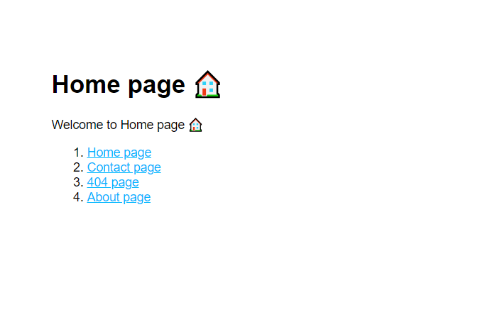

# Basic Info Site
A basic info site built with Express and Node.js.



## Installation
Clone project:
```bash
git clone git@github.com:creme332/my-odin-projects.git
```

Install dependencies for both versions:
```bash
cd my-odin-projects/basic-info-site/node-backend
npm install
```
```bash
cd my-odin-projects/basic-info-site/express-backend
npm install
```

## Usage
Navigate to `my-odin-projects` folder and decide which backend to use.

### Node backend
```bash
cd my-odin-projects/basic-info-site/node-backend
node index.js
```

### Express backend

```bash
cd my-odin-projects/basic-info-site/express-backend
npm start
```