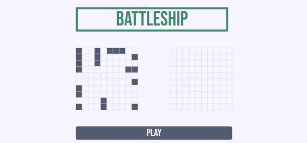

# ⚓Battleship


A single-player battleship game built using test-driven development with Jest. 



[▶ Live Preview](https://creme332.github.io/my-odin-projects/battleship/dist)

# How to play
- Before the game begins, place your ships by dragging and dropping it. You can also rotate your ships by double clicking on it.
- Start the game by pressing on `PLAY` button.
- First player to destroy all of the opponent's ships wins.
- Refresh page to restart game.

> **Warning**
>
> On touchscreen devices, drag and drop may not function properly.

# Features
- Responsive design.
- Drag and drop ships with ghost ship.

# Installation
Clone project:
```
git clone git@github.com:creme332/my-odin-projects.git
```
Move to project directory:
```
cd my-odin-projects/battleship
```
Install dependencies:
```
npm install
```

# Usage
Run project in development mode:
```
npm start
```
Run project in production mode:
```
npm run pstart
```
Generate production build:
```
npx webpack
```

Run tests:
```
npm test
```

# To-do
- [ ] dragstart EV does not work on first try
- [ ] Mark invalid ghost ship with a different color
- [ ] add instructions on how to play to website
- [ ] add tests for `model.js`
- [ ] add ai
- [ ] add method for restarting game.
- [ ] implement multiplayer
- [ ] make drag and drop work on touch screen (Maybe use interactjs library [like this](https://zekumoru.github.io/top-battleship/))

