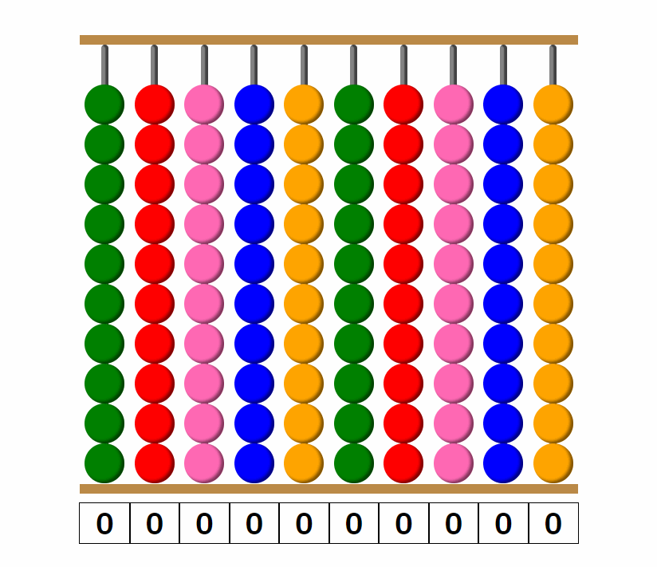
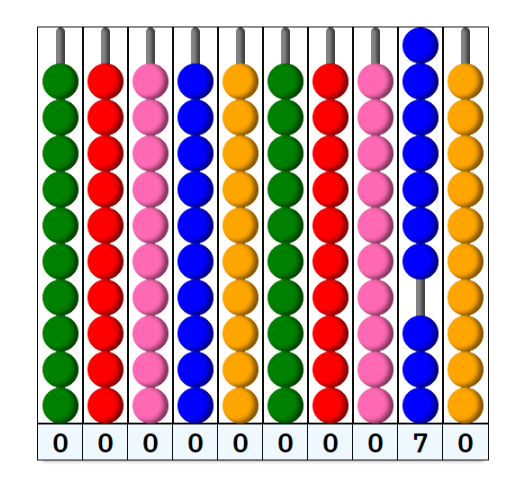

# Calculator 🧮

    
    <em>Addition of 199 and 27 using an abacus</em>

[▶ Live Preview](https://creme332.github.io/my-odin-projects/calculator/)

# 🚀Features
- All basic math operations (addition, subtraction, multiplication, division) are supported.
- Digital counter.
- Computer assistance when overflow/underflow occurs in a column.
- Sound effects.

# 📌 Attributions
Resource | Source
---|---
sound effect |[envato elements](https://elements.envato.com/ball-hits-ball-F4J5TCX?utm_source=mixkit&utm_medium=referral&utm_campaign=elements_mixkit_cs_sfx_tag&_ga=2.1620531.345846574.1660484703-606969087.1658146778)

# 🚀 History of website
