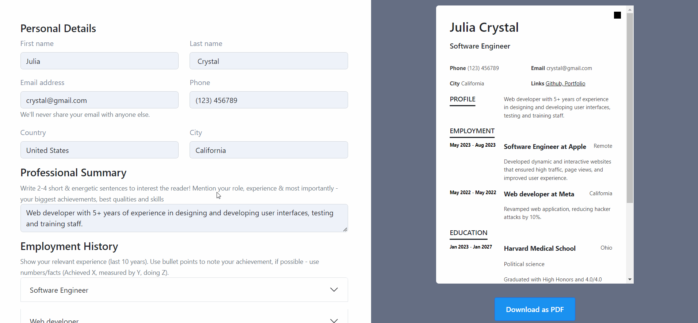
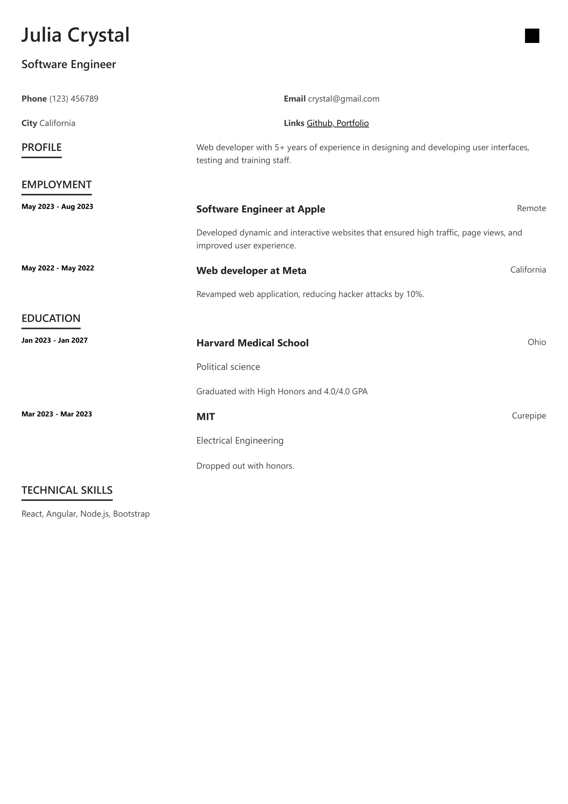

# CV creator

A shitty clone of [resume.io](https://resume.io/) built with React and Bootstrap.



PDF version:


[▶ Live Preview](https://creme332.github.io/my-odin-projects/cv-project/public/)


# 🚀Features
- Mobile responsive design
- Dynamic preview mode
- User-friendly interface
- PDF download

# 🛠 Installation
Clone repository locally
```bash
git clone git@github.com:creme332/my-odin-projects.git
```
Move to project directory
```
cd my-odin-projects/cv-project
```
Install dependencies
```bash
npm install
```
Launch web app  
```bash
npm start
```
Create a production build
```bash
npm run build
```

# Usage
- To enable hyperlinks in PDF, set the print option (in the browser print preview) `Destination` to `Save as PDF`.
  
# 🔨 To-Do
- [ ] Code improvement : merge event handlers for different components
- [ ] Add input validation : start date must be less than end date
- [x] Make mobile responsive (keep size of preview page fixed as screen gets smaller and then relocate/remove preview page)
- [ ] Save form data to localStorage. Use onComponentChange.
- [ ] When there's an overflow in preview mode, add new page instead of scrollbar.
- [ ] Convert into a PWA.
- [ ] Use `react-easy-crop` to allow user to input profile picture.
- [ ] SEO optimization

