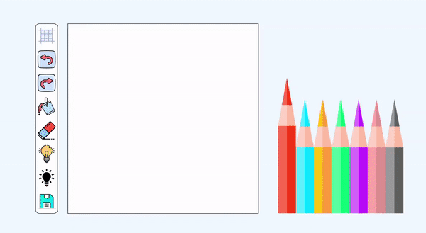

# 🚀Features
- Export image in PDF format.
- Variable grid size.
- `Bucket` to fill multiple pixels with the same color.
- `ColoredBulb` + `Bucket` combination to increase brightness of an area in a single click. 
- `DarkBulb` + `Bucket` combination to decrease brightness of an area in a single click.
- `Eraser` + `Bucket` combination to erase an area in a single click.
- Toggle on/off grid lines.
- Undo/Redo  actions.
- Animated colored pencils made with SVG.

# 📌 Attributions
Resource | Source
---|---
eraser image, paint-bucket image, svg code for pencils, floppy disk logo | Freepik
undo/redo image|  Vitaly Gorbachev
layout image | rizal2109
light bulb image | srip
RGB to HSL converter function | https://css-tricks.com/converting-color-spaces-in-javascript/

# 🔨 To-Do
- [ ] Add dropper
- [ ] Improve export feature.
- [ ] Make website responsive

### ✔ Done
- [x] Add gif to README
- [x] Add export image option
- [x] Add combination : Fill bucket + lighten/darken pixels
- [x] Add alt to image
- [x] Variable grid size (use range slider)
- [x] Add tooltip with description when hovering over options 
- [x] Replace bulb and fire option with 3 options toggle bar
- [x] Lighten/darken pixel by clicking/holding.

# 📖 Debugging notes 

- Value of `GRID_SIZE` must be equal to `height` and `width` properties of `canva`. (Fill bucket will not work otherwise)