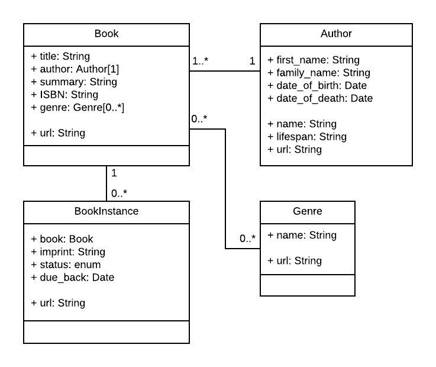

# Express Tutorial: The Local Library website
An implementation of the local library from [a MDN tutorial](https://developer.mozilla.org/en-US/docs/Learn/Server-side/Express_Nodejs/Tutorial_local_library_website) using Express and MongoDB.

## Learning outcomes
- Use the Express Application Generator tool to create a skeleton website and application.
- Start and stop the Node web server.
- Use a database to store your application's data.
- Create routes for requesting different information, and templates ("views") to render the data as HTML to be displayed in the browser.
- Work with forms using Pug.
- Validate and sanitize input using express-validator, and add, delete, and modify records in the database.

## Data model


## Installation
Clone repository:
```bash
git clone git@github.com:creme332/my-odin-projects.git
```

Navigate to project directory:
```bash
cd my-odin-projects/forms-and-deployment
```

Install dependencies:
```bash
npm install
```
If you don't already have a MongoDB database, follow [this tutorial](https://developer.mozilla.org/en-US/docs/Learn/Server-side/Express_Nodejs/mongoose#setting_up_the_mongodb_database) to setup your database. Then, create a file `id.js` in the root directory with the following contents:
```js
const mongoConnectionString = "your_string";
module.exports = mongoConnectionString;
```
To start server:
```
npm run devstart
```

Website will be available at http://localhost:3000/catalog.

## References
Most of the code comes from [this MDN tutorial](https://developer.mozilla.org/en-US/docs/Learn/Server-side/Express_Nodejs/Tutorial_local_library_website).