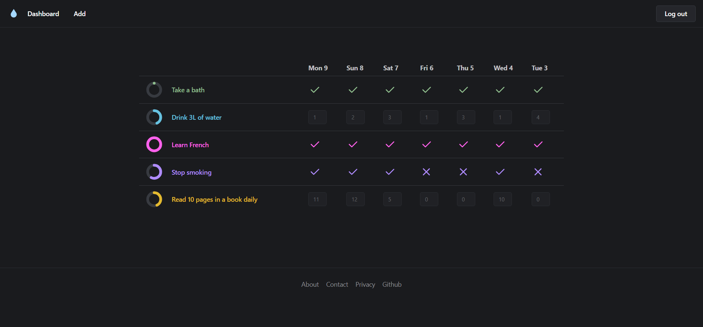
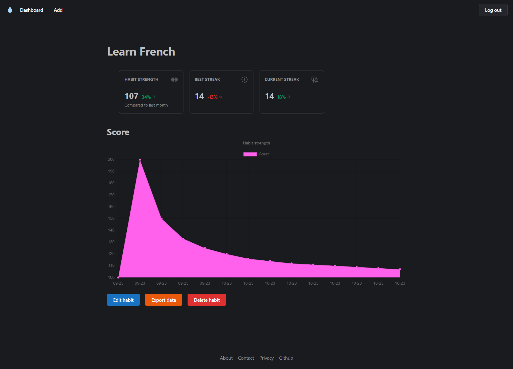

# qkwiqq 💧
A web-based clone of the [Loop Habit Tracker](https://github.com/iSoron/uhabits) mobile app.





[Live Preview ▶](https://qkwiqq.web.app/)

> To try out the app without creating an account, click on the `Log in` button and then on the `Sign in` button.

## Features
- **User authentication with Firebase**
- **Data storage on Firestore**
- **Mobile Responsive**
- **Flexible schedules**: Supports habits with complex schedules, such as 3 times per week, every other day, and twice yearly.
- **Detailed graphs and statistics**
- **Autofill**: Automatically fill entries with a default value so that you don't have to manually enter near-static data every time.
- **Data export**: Export all your data in JSON format at any time.
- **Documentation with jsDocs**

## Installation
Clone project:
```
git clone git@github.com:creme332/my-odin-projects.git
```
Navigate to root directory of the project:
```
cd my-odin-projects/js-final
```

Install dependencies:
```
npm install
```
If you want to use your own Firestore database for storage, modify `firebase-config.js` to add your credentials. You might want to update the security rules in `firestore.rules` as well.

## Usage
To run the development server: 

```bash
npm run dev
```

Open [http://localhost:3000](http://localhost:3000) with your browser to see the result.

To run production server:

```bash
npm run start
```

## To-do
- [ ] Add notice: If the start date of a habit is after the current date, no statistics will be displayed.
- [ ] Use firestore email verification
- [ ] Save login details to localStorage so that user does not have to sign in every time.
- [ ] Make arrows in Grid dynamic
- [ ] Add a calendar
- [ ] Add heatmap
- [ ] Add option to edit old entries
- [ ] Convert to PWA

## Credits
This project was inspired by the [Loop Habit Tracker](https://github.com/iSoron/uhabits) mobile app.