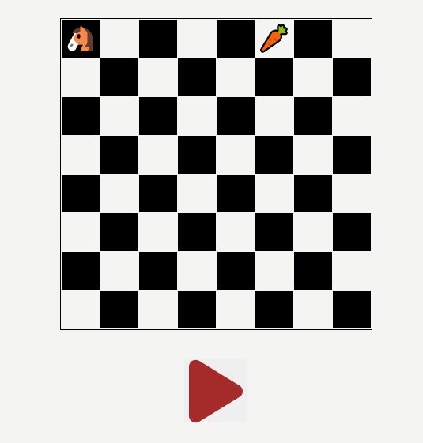

# 🐴 Knights Travails

A visualiser for the Knights Travails problem whereby you have to find the shortest path from the knight (🐴) to some end point (🥕) by making only “L-shaped” moves. Breadth-first-search algorithm is used to find the shortest path.



[▶ Live Preview](https://creme332.github.io/my-odin-projects/knights-travails/dist)

> The shortest path coordinates and path length are visible in console.

# 🚀Features
- Drag and drop with touch support for placing knight and carrot.
- Responsive website.
- Explored cells are shown in grey and shortest path is yellow.

#  🛠 Installation

Clone repository:
```sh
git clone git@github.com:creme332/my-odin-projects.git
```

Go to project folder:
```sh
cd knights-travails
```

Install dependencies:
```
npm install
```

Run tests:
```
npm test
```

Run project in development mode:
```
npm start
```

Generate final version of code:
```
npx webpack --watch
```

# To-do
- [x] fix bug : animation slows down when horse and carrot are at opposite diagonals.
- [ ] add explanation of knights travails problem to website.
- [x] refactor code.
- [ ] knights tour.
- [ ] display shortest moves array on website instead of console.
- [ ] prevent spamming of play button.
- [x] add tests.
- [ ] add obstacles.
- [ ] add option to change animation speed, pause/rewind/forward animation.
