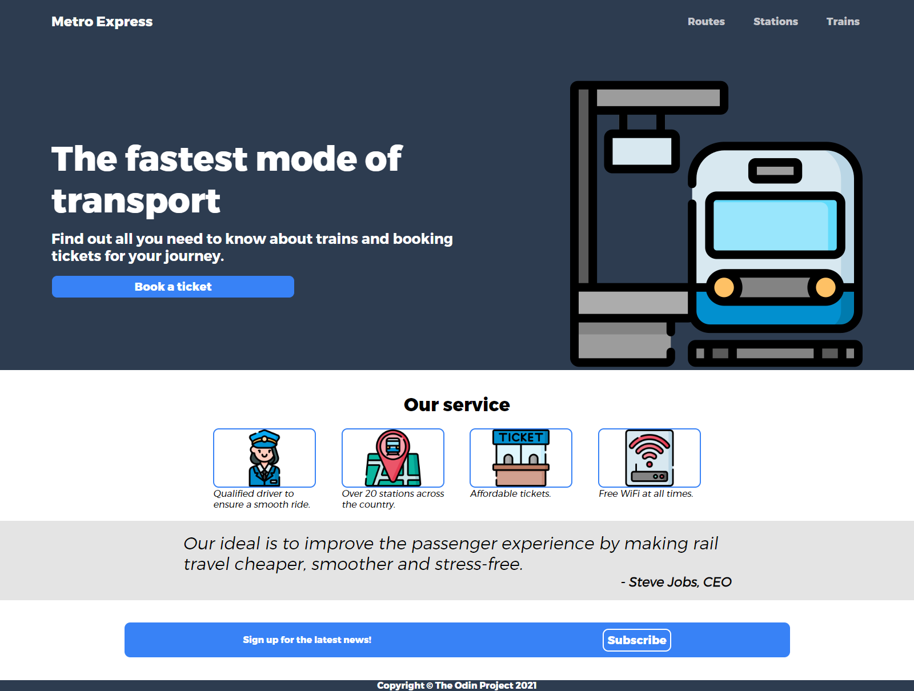
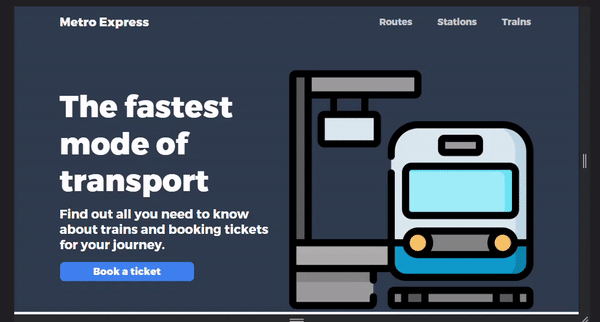

# Landing page 🚂

[Live preview](https://creme332.github.io/my-odin-projects/landing-page/)

# 🚀Features
- Responsive design

# 📌 Attributions
Resouce | Source
---|---
Icons |[Freepik](https://www.flaticon.com/authors/freepik)
Font | [fontzillion](https://www.fontzillion.com/fonts/cannot-into-space-fonts/trueno?utm_source=fontsquirrel.com&utm_medium=matcherator_link&utm_campaign=trueno)
# 🔨 To-Do
- [ ] Create skeleton screen loading page. Check [here](https://github.com/nullilac/skeleton-screen-css)

- [ ] Update quote section : https://github.com/features/copilot

### ✔ Done
- [x] Make website responsive.
- [x] Add favicon
- [x] Add animation when hovering over links and buttons
- [x] Indent "Metro Express" in header
- [x] Fix button and text in top section moving out when resizing screen. 
- [x] Add padding to button
- [x] Add padding to header
- [x] Center sign up box
- [x] Review alignment of service section 
- [x] Fix button in bottom blue box

