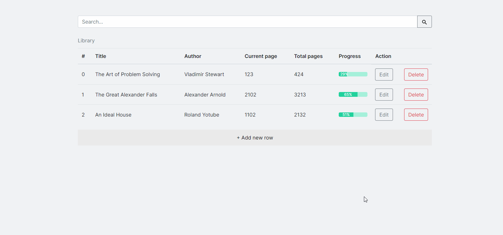

# 📚 Library

A prototype website to keep track of your books and organise your bookshelf.

[▶ Live Preview](https://creme332.github.io/my-odin-projects/library/)

> To save your changes to a row after editing it, you **must** toggle off the Edit button.

> An empty table will always get initialised with some random books when website is refreshed.

# 🚀Features
- Functional search bar.
- Custom-made dynamic progress bar.
- Local Storage to store data after browser is closed/refreshed.

# 🔨 To-Do
- [ ] Use textarea instead of div for user input. 
- [ ] Break table if line too long.
- [ ] Add input validation for page fields.

### ✔ Done
- [x] Make website responsive.
- [x] Edit myLibrary array when field is edited.