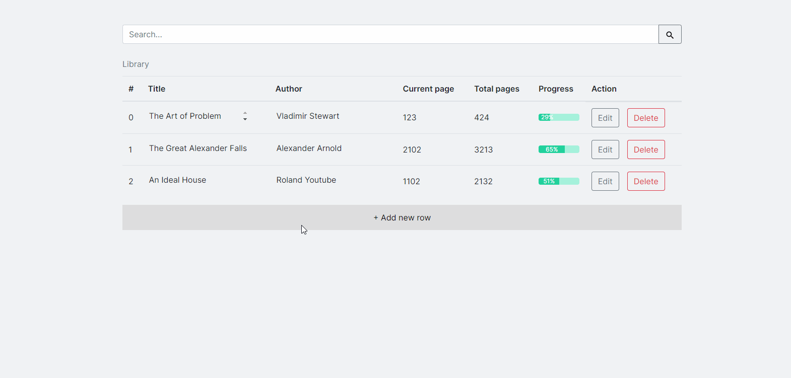

# 📚 Library

A prototype website to keep track of your books and organise your bookshelf.

[▶ Live Preview](https://creme332.github.io/my-odin-projects/library/)

### Notes
- Search functionality is **case-insensitive** and only looks for matches with title and author name.
- To save your changes after editing a row, you **must** toggle off the `Edit` button.

# 🚀Features
- Functional search bar.
- Custom-made dynamic progress bar.
- Local Storage to store your changes after browser is closed/refreshed.
- Input validation.

# 🔨 To-Do
- [ ]

### ✔ Done
- [x] Use textarea instead of div for user input. 
- [x] Use docstring to explain function
- [x] Break table if line too long.
- [x] Add input validation for page fields.
- [x] add classnames to td
- [x] Make website responsive.
- [x] Edit myLibrary array when field is edited.