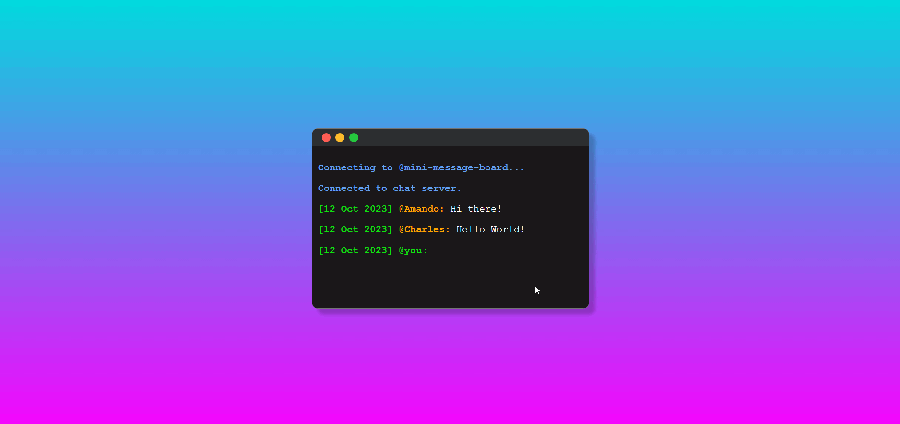

# Mini Message Board 👩‍💻


A simple mobile-responsive message board.



## Installation
Clone repository:
```bash
git clone git@github.com:creme332/my-odin-projects.git
```

Navigate to project directory:
```bash
cd my-odin-projects/mini-message-board
```

Install dependencies:
```bash
npm install
```

Run server:
```bash
npm start
```
## Usage
- To edit your name, click on `@you`.
- To edit your message, click on the empty space on the last line.
- Press `Enter` to submit your message.

## To-do
- [ ] Deploy project somewhere