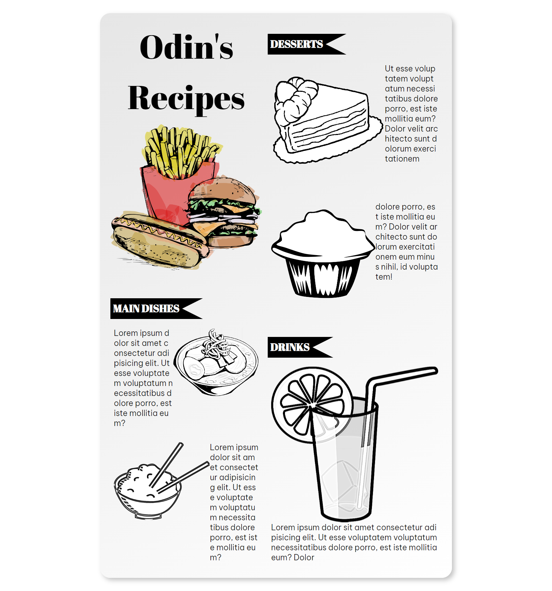
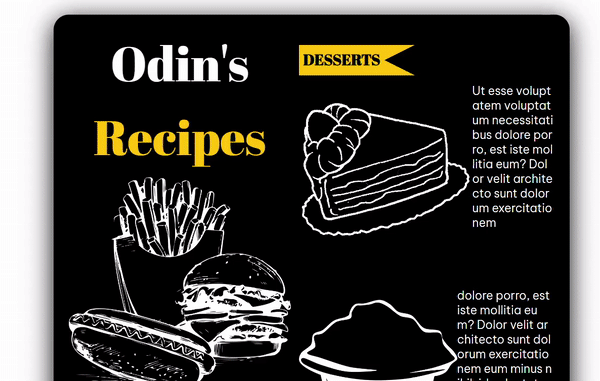
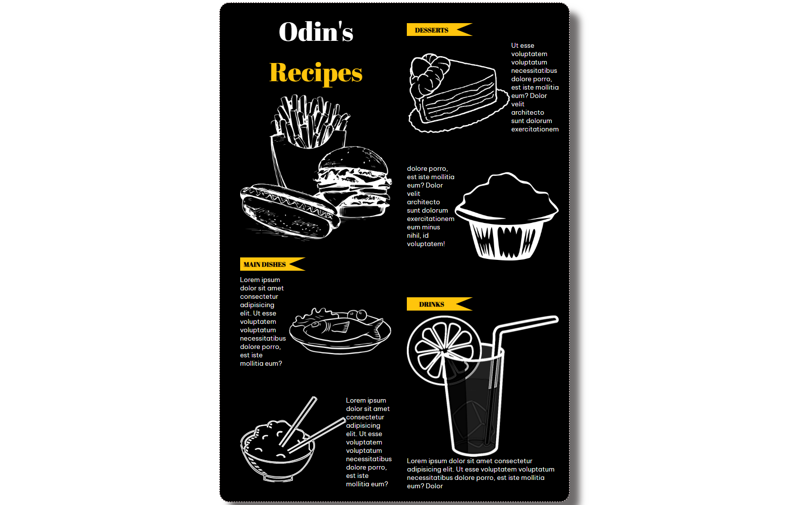

[Live Preview](https://creme332.github.io/my-odin-projects/odin-recipes/)

# 🚀Features
- Responsive design
- Custom scrollbar 
- Hover effects
- Neumorphism effect

# 🔨 To-Do
- [ ] Create skeleton screen loading page.

### ✔ Done
- [x] Make homepage white.
- [x] Make design [responsive](https://www.youtube.com/watch?v=na-X_SM8vg0&ab_channel=ColtSteele). Currently home page and recipe page do not render properly on small screen sizes. (title moves out of box, columns get shrinked, ...)
- [x] Colour of recipe card and background should be different for contrast. Also add box shadow to recipe card.
- [x] Clicking on image instead of `View Recipe` should lead to recipe page.
- [x] Make `View Recipe` appear in middle of image on hover.
- [x] Fix `Drinks` images. Images on homepage should be approximately the same size.
- [x] Add border radius to recipe card 
- [x] Fix font on hover image
- [x] Fix favicon 
- [x] Make CSS 2-column [card](https://www.w3schools.com/howto/tryit.asp?filename=tryhow_css_two_columns_responsive) for recipes
- [x] Try animated CSS [cards](https://fireship.io/lessons/css-cards-animated/) (NOT USED)
- [x] Add screenshots/gif to to README

# 🕒 History of website

