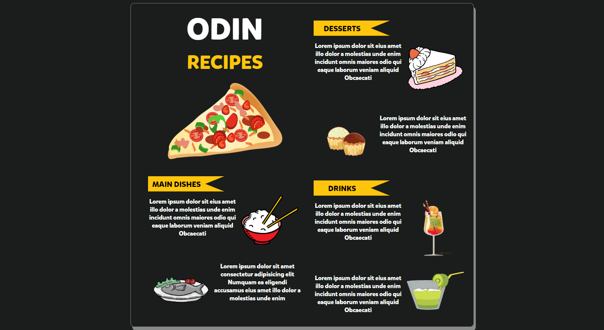

[Live Preview](https://creme332.github.io/my-odin-projects/odin-recipes/)

# To-do

- [ ] Try to convert into a Progressive Web App
- [ ] Fix favicon 
- [x] Make CSS 2-column [card](https://www.w3schools.com/howto/tryit.asp?filename=tryhow_css_two_columns_responsive) for recipes
- [x] Try animated CSS [cards](https://fireship.io/lessons/css-cards-animated/) (NOT USED)
- [x] Add screenshots/gif to to README

## Inspiration

