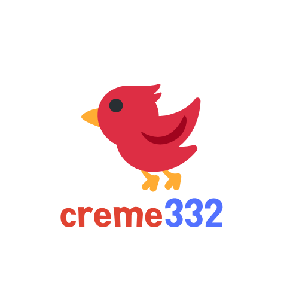

# 🍽 Restaurant page


A simple restaurant homepage generated entirely with JavaScript. 



[▶ Live Preview](https://creme332.github.io/my-odin-projects/restaurant-page/)

# 🚀Features

# 🕶 Usage
Use this space to show useful examples of how a project can be used. Additional screenshots, code examples and demos work well in this space. You may also link to more resources.

#  🛠 Installation
Clone repository locally.
```bash
git clone git@github.com:creme332/my-odin-projects.git
```
Move to project.
```bash
 cd my-odin-projects/restaurant-page
 ```

 Install dependencies.
 ```bash
npm install
 ```

# 📌 Attributions
Resource | Source
---|---
resource| owner

# 🔨 To-Do
- [ ] Make website responsive.
- [ ] Add sitemap + request indexing.
- [ ] Add project social media preview.

### ✔ Done
