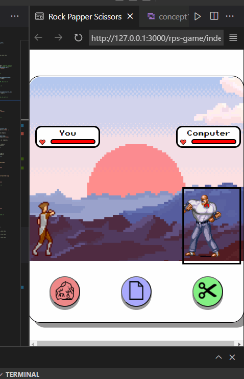

# Rock Paper Scissors game

# To-Do
- [ ] Add favicon
- [ ] Add animated background
- [ ] Add attribution table
- [ ] Add death animation
- [ ] Add footer to all projects to link to README 
- [ ] Fix bug below which occurs when screen size almost matches console size

# Done
- [x] Fix bug with healthbar : Both players were losing health at the same time.
- [x] Add tactile feedback + sound to button
- [x] Add sky and cloud to background and screen
- [x] Add GUI
# Attributions
Resource | Attribution
---|---
rock.png, paper.png| Freepik
[button sound](buttonsound.mp3) | [GRX sounds](https://www.youtube.com/watch?v=8m7i4GdYycs&ab_channel=GFXSounds)
human sprite| [MoikMellah](https://opengameart.org/content/mv-platformer-male-32x64)
computer sprite | [Enscripture](https://www.spriters-resource.com/snes/finalfight3finalfighttough/sheet/36298/)
health bar | [Drew Conley](https://www.youtube.com/watch?v=KJxY6MadV2M&ab_channel=DrewConley)
wallpaper| [wallpaper dog](https://wallpaper.dog/pixel)
Freepik(rock, paper), Tomas Knop(scissor), Pixel perfect(heart)
unknownlogo (Ehtisham Abid)
ghost  (Those Icons)
# Early concept
