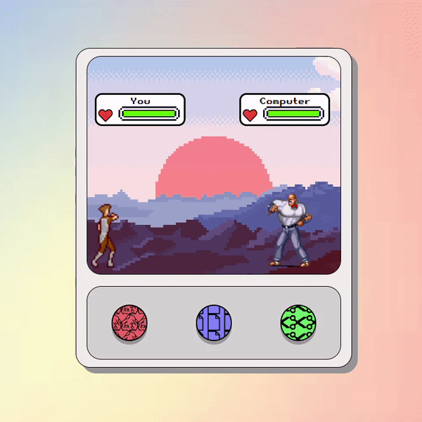
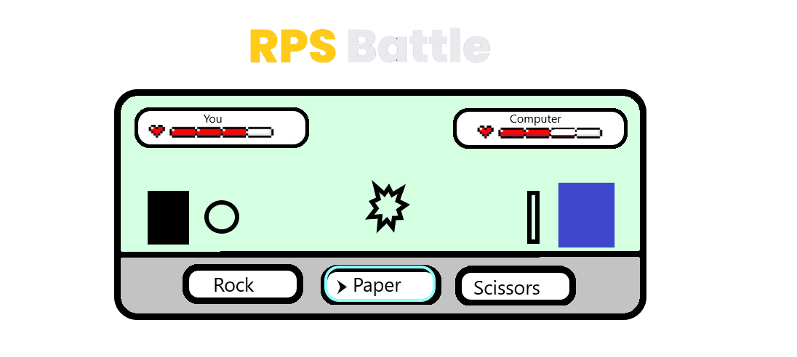

# 🎮 Rock-Paper-Scissors

[Play here](https://creme332.github.io/my-odin-projects/rps-game/)
# 📌 Attributions
Resource | Attribution
---|---
[rock logo ](img/rock.png) + [paper logo](img/paper.png) + [background](img/bg2.jpg) | Freepik
[scissors logo](img/scissors.png) | Tomas Knop
[rock weapon](weapons/rock.png)| https://xenophero.itch.io/
[scissors weapon](weapons/scissors.png) | [bmphelan]([https://www.instructables.com/Pixel-Art-Rock-Paper-Scissors-Game/)
[heart logo](img/heart.png)|Pixel Perfect
[button sound](buttonsound.mp3) | [GFX sounds](https://www.youtube.com/watch?v=8m7i4GdYycs&ab_channel=GFXSounds)
[human sprite](sprites/humansprite.png)| [MoikMellah](https://opengameart.org/content/mv-platformer-male-32x64)
[computer sprite](sprites/computersprite.png) | [Enscripture](https://www.spriters-resource.com/snes/finalfight3finalfighttough/sheet/36298/)
dynamic health bar | [Drew Conley](https://www.youtube.com/watch?v=KJxY6MadV2M&ab_channel=DrewConley)
[background of game arena](img/background.png)| [wallpaper dog](https://wallpaper.dog/pixel)
[favicon of website](img/icons8-game-controller-16.png)| [icons8](https://icons8.com/icons/set/favicon-game)

# 🚀 Early concept

# 🔨 To-Do
- [ ] Add option to restart game.
- [ ] Add animation when taking damage.
- [ ] Add footer to all projects to link to README 

### ✔ Done
- [x] Add death animation
- [x] Bug : Pressing same button multiple times in a single round causes immediate death/win.
- [x] Add attribution table
- [x] Add favicon
- [x] Fix bug with healthbar : Both players were losing health at the same time.
- [x] Replaced img in button with background image to solve bug whereby clicking on img did not trigger click event on button and other related bugs.
- [x] Add tactile feedback + sound to button
- [x] Add sky and cloud to background and screen
- [x] Add GUI
