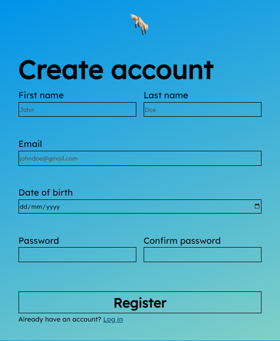
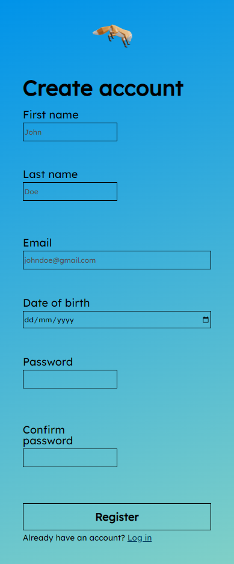

# 📝Sign-up-form

A prototype sign-up-form which follows most of the [Nielsen Norman Group guidelines](https://www.nngroup.com/articles/errors-forms-design-guidelines/).

[▶ Live preview](https://creme332.github.io/my-odin-projects/sign-up-form/)

# 🚀Features

- Input validation. Fields are validated only after input is complete.
- 3D free-to-move fox indicating form progress. Fox's movement speed increases gradually as user successfully completes more input fields.
- Responsive design.

# 📌 Attributions

Resource | Source
---|---
[Fox model](assets/Fox.glb)|[KhronosGroup](https://github.com/KhronosGroup/glTF-Sample-Models/tree/master/2.0/Fox)

# 🔨 To-Do
- [ ] add password strength indicator.
- [ ] On small screen sizes, get rid of row class and make gap between input boxes equal.
- [ ] Implement [hover input animation](https://www.youtube.com/watch?v=lraH4YYUD8o&ab_channel=HankTheTank).

### ✔ Done
- [x] Add GIF to readme
- [x] Fix layout shifts when error messages are displayed.
- [x] Make website responsive.
- [x] Don’t validate fields before input is complete.

