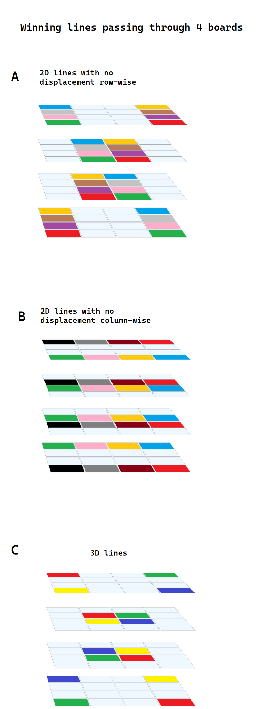
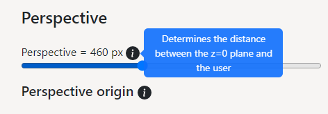

# 🎮 Tic-Tac-Toe (Qubic)


Play 3D Tic-Tac-Toe on a free-to-rotate 4x4x4 grid against a friend or an AI. 


[▶ Live Preview](https://creme332.github.io/my-odin-projects/tic-tac-toe/)

# Features
- 2-player and AI modes.  
- 3D free-to-move 4x4x4 grid.
- Tooltip explanations for settings.
- Winning cells are highlighted.
- Responsive website.
- How-to-play section.

# Usage

## How to play

After choosing a game mode, click on "Restart game" button.

Players take turns placing their markers in blank cells in the array. The first player to place four of their own markers in a line wins. The winning line can be horizontal, vertical, or diagonal on a single board as in regular tic-tac-toe, or vertically in a column, or a diagonal line through four boards. 

Here's a **non-exhaustive** list of possible winning lines :



More information about the 76 possible winning lines can be found in [`wincheck.js`](wincheck.js).

## Settings
The sliders are **not** for cosmetic purposes and can be used to visualise the winning lines better. 

If auto-rotate is on and the the rotating grid is not fully visible, try increasing `perspective`. For explantion on the settings, hover on the `i` icon
 


## AI
AI uses minimax algorithm with alpha-beta pruning. The depth of the minimax algorithm is set to 3. While this depth can be increased to make the AI stronger, the response time of AI will increase significantly and may cause website to crash.

The heuristic for the algorithm can be found [here](https://github.com/ghorned/Qubic#heuristic).

# Installation

Clone repository locally
```bash
git clone git@github.com:creme332/my-odin-projects.git
```

## Testing
`wincheck.test.js` contains a set of tests to verify that the win checking algorithm is working properly. Jest is used for testing.

Move to `tic-tac-toe` project directory.
 ```bash
cd tic-tac-toe 
 ```

Install dependencies 
```
npm install
```
Run tests 
 ```
 npm run test
 ```

# References

Resource | How I used it
---|---
[Jest](https://jestjs.io/docs/getting-started)  | For testing win-checking algorithm
[Bootstrap](https://getbootstrap.com/docs/5.2/getting-started/introduction/) | To implement settings and how-to-play section.
[Heuristic for minimax algorithm](https://github.com/ghorned/Qubic#heuristic) | Heuristic algorithm for Qubic AI
[Game 1 by mathsisfun](https://www.mathsisfun.com/games/foursight-3d-tic-tac-toe.html), [Game 2 by klimbin](https://github.com/klimbin/Qubic), [3D Qubic by DennisChunikhin](https://github.com/DennisChunikhin/Qubic) | For inspiration
[Codewars kata](https://www.codewars.com/kata/5aa67541373c2e69a20000c9) | To test win-checking algorithm
 [css-tricks](https://css-tricks.com/how-css-perspective-works/), [3dtransforms](https://3dtransforms.desandro.com/perspective)| For reference on CSS Perspective
[MIT video](https://www.youtube.com/watch?v=STjW3eH0Cik&ab_channel=MITOpenCourseWare), [Sebastian Lague video](https://www.youtube.com/watch?v=l-hh51ncgDI&t=142s&ab_channel=SebastianLague)| To implement minimax algorithm with alpha-beta pruning.

# License 
MIT

# To-Do
- [ ] Add game over screen.
- [ ] Use three.js library to implement more 3D controls with mouse.
- [ ] Add varying difficulty levels for 1-player
- [ ] Improve win-checking algorithm for Case 3, 4.
- [ ] Test all 76 possible winning lines with Jest.

### Done
- [x] Add possibility to control sliders with mouse 
- [x] change default color of  grid cell
- [x] Improve UI
display game over screen.
- [x] Add "How to play" popover
- [x] Add docstring to functions.
- [x] rename IDs in HTML to be more meaningful.
- [x] Fix : cannot toggle transparency properly midgame
- [x] Add AI.

