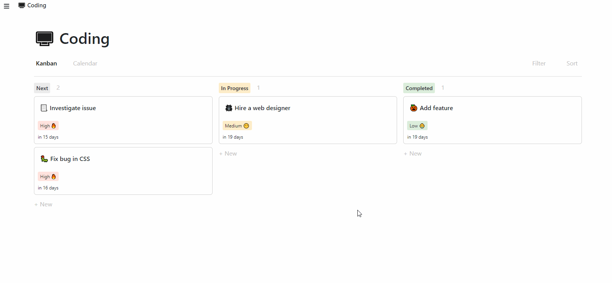

# 📝 Todo List


A simple to-do list.


⚠ Above GIF contains some visual glitches which are not part of the website.

[▶ Live Preview](https://creme332.github.io/my-odin-projects/todo-list/dist)

# 🚀Features
- Sortable drag and drop to-do items
- Responsive design
- Calendar view
- Kanban view
- Expandable to-do items
- Priority levels
- Tasks can be grouped in projects
- Web storage API for data storage

#  🛠 Installation
Clone repository locally
```bash
git clone git@github.com:creme332/my-odin-projects.git
```
Move to project directory
```
cd my-odin-projects/todo-list
```
Install dependencies
```bash
npm install
```
Launch web app in development mode 
```bash
npm start
```
Go to  http://localhost:8080/ on browser.

# 📌 Attributions
Resource | For
---|---
[Notion To-do template](https://www.notion.so/templates/to-dos)| UI inspiration
[WebDevSimplified](https://www.youtube.com/watch?v=jfYWwQrtzzY&ab_channel=WebDevSimplified), [web.dev](https://web.dev/drag-and-drop/) | Sortable drag and drop feature
fontawesome | Icons

# 🔨 To-Do
- [ ] add sorting and filtering
- [ ] make calendar responsive
- [ ] add touch support to drag and drop feature
- [ ] add a delete project/task confirmation message
- [ ] Allow user to perform CRUD on calendar view.
- [ ] add start/end date for task 
- [ ] save comments to task object
- [ ] add recurring due dates
- [ ] add login page
- [ ] create a module only for kanban view
- [ ] create a module only for dealing with sidebar
- [ ] optimise bundling process (dupllicate imports?, import only used icons)
- [ ] create a release for project

### ✔ Done
- [x] update docstrings
- [x] save data somewhere (firestore, local storage, google login)
- [x] refactor css
