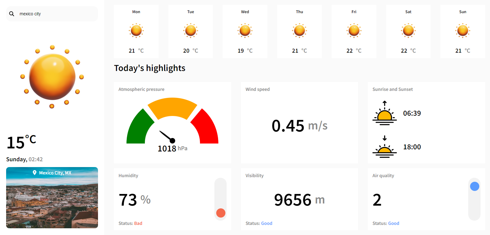

# ☁ Weather app


A weather dashboard that displays the weather data of any city. OpenWeatherMap API is used for weather data and Unsplash API is used for city images.



[▶ Live Preview](https://creme332.github.io/my-odin-projects/weather-app/dist)

# 🚀Features
- 7 day weather forecast.
- Animated pressure gauge.
- Responsive design.
- Loading animation while data is being fetched.

# 📌 Attributions
Resource | Origin
--|--
UI | [TSD lab](https://www.uplabs.com/posts/weather-dashboard-e99e00a9-48e5-4d25-a995-f481e5b4a892), [Anton Mikhaltsov](https://dribbble.com/shots/10460680-Weather-App)
3D weather icons | nainmade on Figma
Sunrise and sunset icons | Mehwish on [Flaticon](https://www.flaticon.com/free-icon/sunset_3920799?term=sunset&page=1&position=3&page=1&position=3&related_id=3920799&origin=search)
Location and search icons | fontawesome
Pressure gauge | [Anuj Yadav](https://codepen.io/yadavanuj1996/pen/vYBqZPP) on Codepen

#  🛠 Installation
Clone repository locally:
```bash
git clone git@github.com:creme332/my-odin-projects.git
```
Move to project directory:
```
cd my-odin-projects/weather-app
```
Install dependencies:
```
npm install
```
Run project in development mode:
```
npm start
```
To update the production deployment folder, (`dist`) :
```
npx webpack --watch
```
> ⚠ The OpenWeatherMap API key (free tier) was purposefully left in the code. You might want to change/remove it.

# To-do
- [ ] improve responsiveness for tablets
- [x] add badges
- [x] inform user when city name is invalid
- [ ] add docstring to template